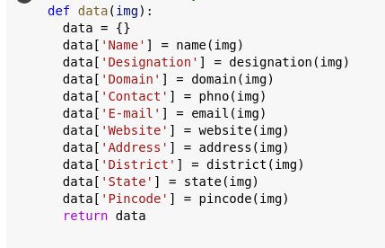

<h1 align="center">Biz_Card Extraction using Easy_OCR"</h1>

Extracting informations from the Biz_Card using Easy_OCR is a very simple task.

## Deployment

To deploy this project run

```bash
  pip install easyocr
  
  reader = easyocr.Reader(['ch_sim','en'])
```
This all, but with Regular Expressions...you will be able to segregate each info's in respective way.

```bash
  import regex as re
```
  
Once you have the reader object, you can use it to extract the information from the Biz_Card.
WHhen the Biz_Card is extracted, you will get the following information:



## DATAFRAME


## Creating a user_interface website using Streamlit

This helps user to upload their extracted buissness card information and upload it to SQLite database and it will provide a searchable user interface.

## Home


## Search Interface


## Support

 email : danavasanth@gmail.com 

